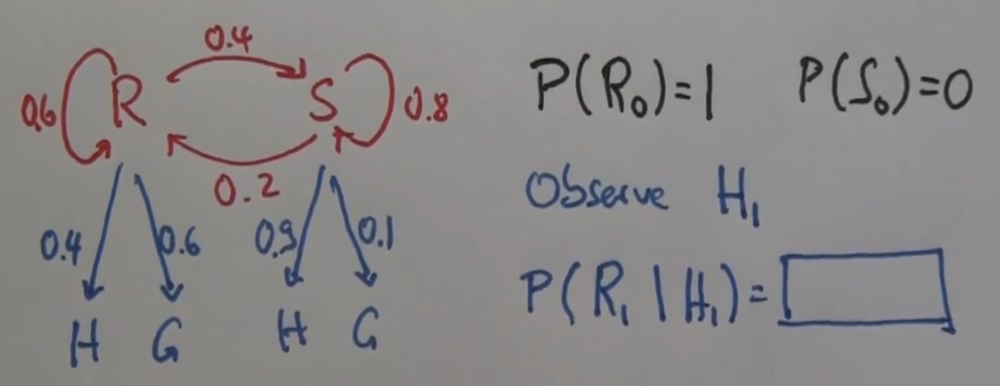

Markov Chains - Hidden Markov Models
====================================

Código del curso [CS50’s Introduction to Artificial Intelligence with Python](https://cs50.harvard.edu/ai/2024/), _lecture 2 "uncertainty"_, refactorizado a la nueva api de pomegranate v1.0.4 [jmschrei](https://pomegranate.readthedocs.io/en/latest/tutorials/B_Model_Tutorial_4_Hidden_Markov_Models.html)

## Instalación

Es necesario el uso del paquete [Pomegranate](https://pomegranate.readthedocs.io/en/stable/index.html):

> Pomegranate is a python package which implements fast, efficient, and extremely flexible probabilistic models ranging from probability distributions to Bayesian networks to mixtures of hidden Markov models.

`python -m venv venv`

`source venv/bin/activate`

Instalar la versión estricta de pomegranate `v1.0.4`:

`pip install -r requirements.txt`

o

`pip install pomegranate`

## Uso

### Markov Chain

Vamos a construir una cadena de Markov donde las variables aleatorias siguen la suposición de Markov: el estado actual depende sólo de un número finito de estados previos.

Supongamos que podemos definir la probabilidad de que mañana sea un dia soleado o llueva en función de cómo está el tiempo hoy. 

Definimos el modelo de transición de nuestro ejemplo de este modo:

Probabilidades iniciales de lluvia (R) y sol (S) en el primer día de la serie:

$$ P(R_0) = 0.5 $$
$$ P(S_0) = 0.5 $$

El modelo de transiciones es este:

|  Hoy  | Mañana|       |
| :---: | :---: | :---: |
|       |  sol  | lluvia|
| sol   |  0.8	|  0.2  |
| lluvia|  0.3  |   0.7 |

Calculamos un posible serie de predicciones sobre el estado del tiempo dadas la probabilidades iniciales y el modelo de transiciones:

```python
$ python markov_chain/model.py

Numero de muestras: 50
rain -> rain -> rain -> sun -> rain -> sun -> rain -> sun ->
rain ->rain -> rain -> rain -> rain -> sun -> sun -> sun ->
sun -> sun -> sun -> sun -> sun -> rain -> rain -> sun -> 
sun -> sun -> sun -> rain -> rain -> rain -> sun -> sun -> 
sun -> sun -> rain -> rain -> rain -> rain -> rain -> sun ->
sun -> rain -> sun -> sun -> sun -> rain -> rain -> rain -> sun -> sun
```

### Hidden Markov Model

En muchas ocasiones el estado del mundo es desconocido, pero de algún modo el agente inteligente es capaz de percibir información sobre el mundo mediante sus sensores. A partir de estas observaciones podemos inferir determinados aspectos del estado oculto, ya que dicho estado oculto influencia las observaciones.

Vamos a construir un modelo oculto de Markov en el que deduciremos el estado del tiempo en función de las observaciones que realiza nuestro agente inteligente sobre si las personas que entran en un edificio portan paragüas.


Las probabilidades de emisión son las siguientes:

| Estado| Observación|       |
| :---: | :---:      | :---: |
|       |  paraguas   | sin paraguas  |
| sol   |  0.2	     |  0.8  |
| lluvia|  0.9       |  0.1  |

Estas probabilidades de emisión dependen únicamente del estado del tiempo hoy. 

Proporcionamos al modelo una serie de observaciones y nos devuelve la secuencia de estados más probable (la explicación más probable).

```python
$ python hmm/model.py

Dimensiones del array de observaciones: (1, 9, 1)
umbrella -> rain
umbrella -> rain
no_umbrella -> sun
umbrella -> rain
umbrella -> rain
umbrella -> rain
umbrella -> rain
no_umbrella -> sun
no_umbrella -> sun
```

## Matemática de los Hidden Markov Models

Si $X_i$ son los estados ocultos y $Z_i$ son las emisiones, las expresiones de la teoría de probabilidad que conforman los parámetros de entrada de nuestro modelo son:

[1] **Regla de Bayes**:

$$ P(X_1 | Z_1) = \frac {P(Z_1 | X_1) P(X_1)} {P(Z_1)} = \alpha P(Z_1 | X_1) P(X_1) $$

[2] **Probabilidad total**:

$$ P(X_2) = \sum_{X_1} P(X_1)P(X_2|X_1) $$

donde $ P(X_2|X_1) $ es la distribución de probabilidad del siguiente estado.

[3] Necesitamos la(s) distribuciones de **probabilidad**(es) del estado(s) **inicial**(es):

$$ P(X_0) $$

### Ejercicio

Aplicando las expresiones [1], [2] y [3] del epígrafe anterior, resuelve el siguiente problema.

Se trata de uno de los problemas propuestos en el MOCC sobre IA por Sebastian Thrun para explicar cómo se calculan las probabilidades de los estados ocultos dadas las observaciones.

Supongamos que queremos construir un modelo oculto de Markov para calcular el estado del tiempo en función del estado de humor de la población. En función de las observaciones sobre si la gente está feliz o gruñona deduciremos las probabilidades de que el día esté soleado o lluvioso.

En la figura se describen las probabilidades de transición entre los estados _Rainy_ $R$ y _Sunny_ $S$. Se proporcionan también las probabilidades de las emisiones _Happy_ $H$ y _Grumpy_ $G$. 


Se pide calcular la probabilidad de que el día 1 sea lluvioso $R_1$ en función de que la observación arroje que la gente está contenta  ese día $H_1$, dadas las probabilidades iniciales de los estados:

$$ P(R_0) = 1 $$
$$ P(S_0) = 0 $$

como se indica en la figura:

